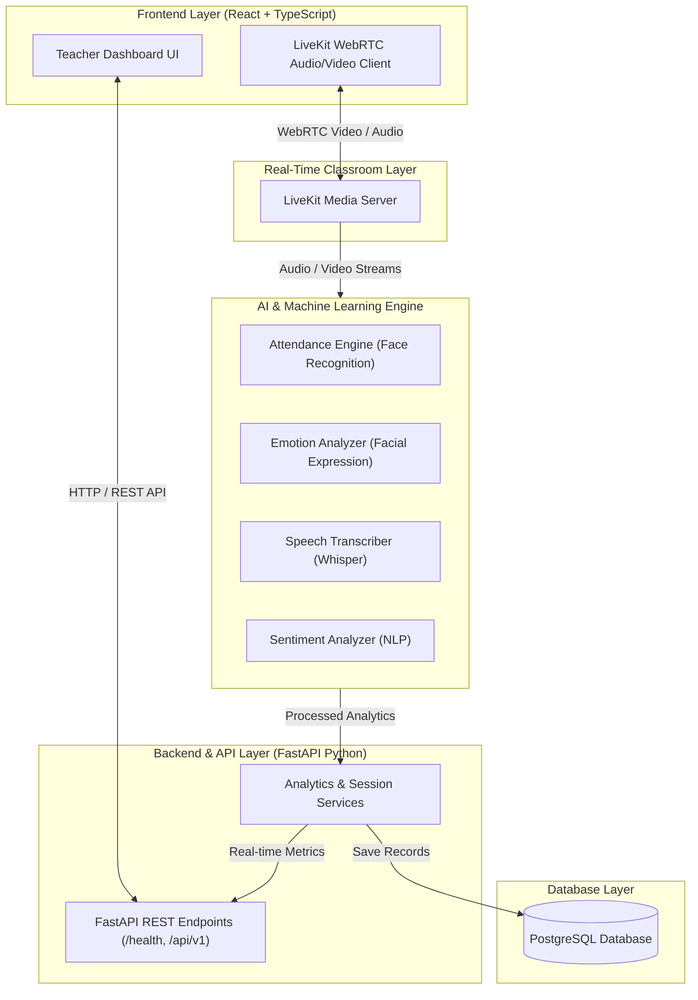

# EduSense AI - System Architecture Overview

EduSense AI is structured as a decoupled multi-modal AI analytics platform.

## System Components

1. **Frontend (React + Vite + TypeScript)**:
   Provides real-time interactive teacher dashboards, video feed visualization, and student engagement metrics.
2. **Backend (FastAPI)**:
   High-performance asynchronous API server handling auth, session management, and routing analytical results.
3. **Database (PostgreSQL + SQLAlchemy)**:
   Relational database storing student profiles, attendance records, classroom session metrics, and analytical logs.
4. **Real-Time Classroom (LiveKit)**:
   Low-latency WebRTC media server streaming student & teacher audio/video feeds.
5. **AI Core Modules**:
   - `ai/attendance`: Face detection & recognition for attendance logging.
   - `ai/emotion`: Facial expression analysis for attention & mood tracking.
   - `ai/speech`: Whisper speech-to-text transcription.
   - `ai/sentiment`: NLP sentiment analysis on transcripts & chat input.
