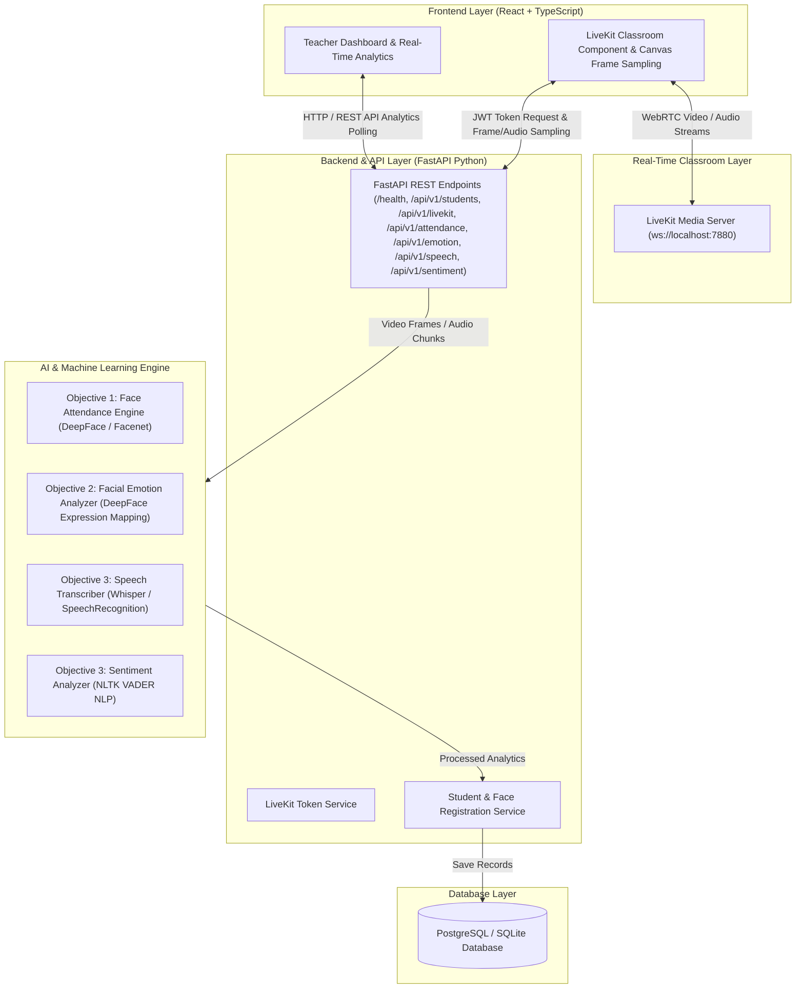

# EduSense AI - System Architecture Overview

EduSense AI is structured as a decoupled multi-modal AI analytics platform.

## System Components

1. **Frontend (React + Vite + TypeScript + LiveKit Client)**:
   Provides real-time interactive teacher dashboards, video feed visualization, and WebRTC audio/video classroom streaming using `livekit-client`. Performs periodic frame sampling and audio transcription requests.
2. **Backend (FastAPI)**:
   High-performance asynchronous API server handling auth, LiveKit access token generation (`POST /api/v1/livekit/token`), student registration (`/api/v1/students/register-face`), attendance recognition (`/api/v1/attendance/recognize`), facial emotion analysis (`/api/v1/emotion/analyze`), speech transcription (`/api/v1/speech/transcribe`), and text sentiment analysis (`/api/v1/sentiment/analyze`).
3. **Database (PostgreSQL / SQLite + SQLAlchemy 2.0)**:
   Relational database storing student profiles (`students`), face embeddings (`face_embeddings`), attendance records (`attendance_records`), facial engagement logs (`emotion_records`), transcripts (`speech_transcripts`), and sentiment results (`sentiment_records`).
4. **Real-Time Classroom (LiveKit)**:
   Low-latency WebRTC media server streaming student & teacher audio/video feeds.
5. **AI Core Modules**:
   - `ai/attendance`: Pretrained DeepFace / Facenet embedding extraction & cosine similarity matching for automated attendance logging.
   - `ai/emotion`: Facial expression analysis mapping raw emotions to classroom engagement states (`attentive`, `neutral`, `confused`, `disengaged`).
   - `ai/speech`: OpenAI Whisper speech-to-text transcriber.
   - `ai/sentiment`: NLTK VADER sentiment analysis engine classifying text into `positive`, `neutral`, or `negative`.
